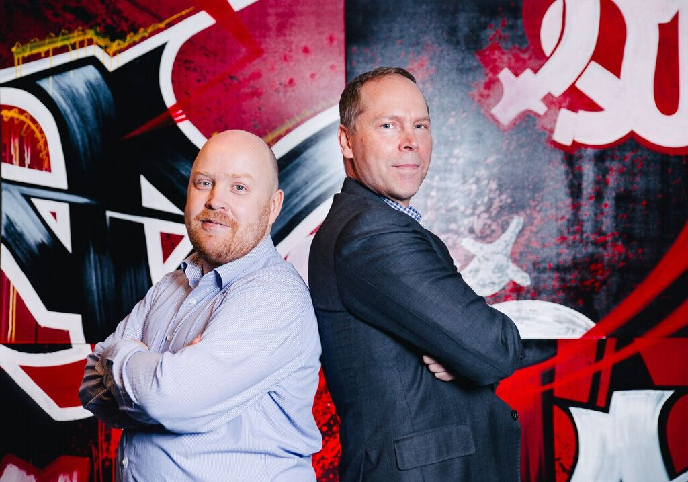

---

layout: sc5

---

# Presentations in our brand style {#cover}

Varya Stepanova, <span class="position">Senior Software Specialist</span>
{:.author}


## Influencing the industry

Sometimes we need to make a developer's presentation

* Meetups
* Conferences
* Presentations at client's

### keep within brand style
{: .next}


## HTML presentations

<div class="double" markdown="1">

### Loved for

* being hipster
* showing how geeky we are
* its sweetness

### Good because

* can be hosted on the web
* extensible
* this is what we know best

</div>


## Lea Verou & her html presentations

[Lea Verou and her alive presentation](https://player.vimeo.com/video/67567648?autoplay=0#t=200s)


## My own experience

* <s>Keynote</s>
* 3 years of HTML preentations


## Shower

{: .logo} [github.com/shower](https://github.com/shower/shower){: .link }

<style>
#shower .logo {
  width: 150px;
  vertical-align: middle;
}
#shower .link {
  margin-left: 0.5em;
  font-size: 2.25em;
}
</style>


## What about our brand?

Shower has themes!

<div class="next" markdown="1">

### SC5 theme for Shower

[sc5.github.io/shower-sc5](https://sc5.github.io/shower-sc5/)

</div>


## Kinds of slides
{: .slide--shout .slide--red }

## Blank slide

## Plain text

Design strategy is a management tool to deliver world class user interfaces and enable excellent user experience. In the
future, UX aspects will become naturally considered as a part of product strategy. Before this happens, it seems
necessary to manage UX strategy specifically. This post reveals the secret weapon SC5 uses in designing strategy.

Spoiler: no weapon, we are just awesome.
{: .note }

## Inline elements

Essential part of the [design leadership]() practice are the tools and methods deployed by the leaders. The details of
**strategy, vision and roadmap** documents all depend on the domain of business. Style and brand guides intersect design
with marketing. In business-to-consumer business, interesting challenge is the increasing number of channels or
touchpoints in which customers *engage with the company*. Without a coherent approach under design leadership, everything
can <code>fall apart</code>.

## we can — we share — we care
{: .slide--shout .slide--red }

## we can — we share — we care
{: .slide--shout .slide--azure }


## full image
{: .slide--full-image }



## Brand icons
{: .slide--shout .slide--azure }

## Icons cheatsheet
{: .icon-cheatsheet }


<style>
  .icon-cheatsheet .svg {
    margin: 10px;
  }
</style>

## Icons cheatsheet
{: .icon-cheatsheet .slide--red }

{: .svg }
{: .svg }
{: .svg }
{: .svg }
{: .svg }
{: .svg }
{: .svg }
{: .svg }
{: .svg }
{: .svg }
{: .svg }
{: .svg }
{: .svg }
{: .svg }
{: .svg }
{: .svg }
{: .svg }
{: .svg }
{: .svg }
{: .svg }
{: .svg }
{: .svg }
{: .svg }
{: .svg }
{: .svg }
{: .svg }
{: .svg }
{: .svg }
{: .svg }
{: .svg }
{: .svg }
{: .svg }
{: .svg }
{: .svg }
{: .svg }
{: .svg }
{: .svg }
{: .svg }
{: .svg }
{: .svg }
{: .svg }
{: .svg }
{: .svg }
{: .svg }
{: .svg }
{: .svg }
{: .svg }
{: .svg }
{: .svg }
{: .svg }
{: .svg }
{: .svg }
{: .svg }
{: .svg }
{: .svg }
{: .svg }
{: .svg }
{: .svg }
{: .svg }


## Icons cheatsheet
{: .icon-cheatsheet .slide--azure }

{: .svg }
{: .svg }
{: .svg }
{: .svg }
{: .svg }
{: .svg }
{: .svg }
{: .svg }
{: .svg }
{: .svg }
{: .svg }
{: .svg }
{: .svg }
{: .svg }
{: .svg }
{: .svg }
{: .svg }
{: .svg }
{: .svg }
{: .svg }
{: .svg }
{: .svg }
{: .svg }
{: .svg }
{: .svg }
{: .svg }
{: .svg }
{: .svg }
{: .svg }
{: .svg }
{: .svg }
{: .svg }
{: .svg }
{: .svg }
{: .svg }
{: .svg }
{: .svg }
{: .svg }
{: .svg }
{: .svg }
{: .svg }
{: .svg }
{: .svg }
{: .svg }
{: .svg }
{: .svg }
{: .svg }
{: .svg }
{: .svg }
{: .svg }
{: .svg }
{: .svg }
{: .svg }
{: .svg }
{: .svg }
{: .svg }
{: .svg }
{: .svg }
{: .svg }


## Quote in text

<blockquote markdown="1">

Digitalisaation myötä erinäisten IT palveluiden rooli muuttuu perinteisestä liiketoiminnan tukitoiminnosta
liiketoiminnan mahdollistajaksi.

</blockquote>

### Quote with sign

<figure>
  <blockquote>
    <p>Deep Learning has many different definitions depending on who you ask.</p>
  </blockquote>
  <figcaption>Max Pagels</figcaption>
</figure>


## Big quote and author
{: .slide--red .slide--shout .slide--no-title }

<figure>
  <blockquote>
    <p>One of the most common struggles in maintaining a large website, is how to implement icons.</p>
  </blockquote>
  <figcaption>Iikka Winter</figcaption>
</figure>


## Big quote
{: .slide--red .slide--shout .slide--no-title }

<blockquote markdown="1">

Fonts did a good job for a while with ability to use scalable vector graphics and css for styling, but clearly we can
see that it was just a matter of time for a better, more suitable solution to arise.

</blockquote>


## Title and subtitle

### Hei, I'm here!
{: .subtitle }


## Nested list

1. Data science
   1. Is your organization data ready?
   1. Friendly Introduction to Machine Learning
1. Development
   * Persisting Docker Volumes in ECS using EF
   * Introducing: the SC5 serverless bot workshop


## Block list

* Coffee
* Tea
  * Black tea
  * Grean tea
* Milk


## Latin and cyrillic list bullets

* How much can I expect to learn the first night?
* Which is the most difficult programming language to learn?
{: lang="en" }

* Как многому можно научиться за первую ночь?
* Какой язык программирования самый сложный?
{: lang="ru" }


## Hidden list


* Mix dry ingredients thoroughly.
* {:.next}Pour in wet ingredients
* {:.next}Mix for 10 minutes.
* {:.next}Bake for one hour at 300 degrees.


## Two columns

<div class="double" markdown="1">

Pilvipalveluita on tähän saakka tyypillisesti käytetty joko olemassa olevan konesalikapasiteetin korvaamiseen tai
laajentamiseen, jolla on saavutettu kustannushyötyjä ja joustavuutta kapasiteetin hallintaan.

Tämä on ns.
“infrastruktuuri palveluna” -pilvi (Infrastructure as a Service eli IaaS). Nämä palvelut toki auttavat kykyyn vastata
nopeammin yllättäviin resurssivaihteluihin ja mahdollistavat kustannussäästöjä kun infrastruktuuria ei tarvitse olla
“kaiken varalta” varastossa, mutta ne eivät itsessään valjasta koko pilven potentiaalia käyttöön.

</div>


## Two columns with titles

<div class="double" markdown="1">

### Apples

* Taste funny
* Cheap
* Preserve well

### Oranges

* Juicy
* Heavy
* Redundant parts

</div>


## Three columns

<div class="triple" markdown="1">

What I almost immediately noticed when I started working at SC5 was how incredibly laid back they were for being such a
professional institution. The first thing that comes to mind when you think of a consulting and web development
organization that specializes in cloud based solutions, is probably not that a couple of employees could play an
adventure time card game during their break.

</div>


## Striped Table

| Tables        | Are           | Cool  |
| ------------- |:-------------:| -----:|
| col 3 is      | right-aligned | $1600 |
| col 2 is      | centered      |   $12 |
| zebra stripes | are neat      |    $1 |
{: .striped }


## Code listing

    <html lang="en">
    <head> <!--Comment-->
      <title>Shower</title>
      <meta charset="UTF-8">
      <link rel="stylesheet" href="screen.css">
      <script src="script.js"></script>
    </head>


## Code with highlighting

<pre><code>&lt;html lang="en"&gt;
<mark>&lt;head&gt;</mark> <span class="comment">&lt;!--Comment--&gt;</span>
	&lt;title&gt;Shower&lt;/title&gt;
	&lt;meta charset="<mark class="important">UTF-8</mark>"&gt;
	&lt;link rel="stylesheet" href="screen.css"&gt;
	&lt;script src="script.js"&gt;&lt;/script&gt;
<mark>&lt;/head&gt;</mark></code></pre>


## Numbered code listings
<pre>
  <code>&lt;html lang="en"&gt;</code>
  <code><mark>&lt;head&gt;</mark> <span class="comment">&lt;!--Comment--&gt;</span></code>
  <code>	&lt;title&gt;Shower&lt;/title&gt;</code>
  <code>	&lt;meta charset="<mark class="important">UTF-8</mark>"&gt;</code>
  <code>	&lt;link rel="stylesheet" href="screen.css"&gt;</code>
  <code>	&lt;script src="script.js"&gt;&lt;/script&gt;</code>
  <code><mark>&lt;/head&gt;</mark></code>
</pre>


## Highlighted code lines

<pre>
  <code>&lt;html lang="en"&gt;</code>
  <code class="mark">&lt;head&gt; <span class="comment">&lt;!--Comment--&gt;</span></code>
  <code>	&lt;title&gt;Shower&lt;/title&gt;</code>
  <code>	&lt;meta charset="<mark class="important">UTF-8</mark>"&gt;</code>
  <code>	&lt;link rel="stylesheet" href="screen.css"&gt;</code>
  <code>	&lt;script src="script.js"&gt;&lt;/script&gt;</code>
  <code class="mark">&lt;/head&gt;</code>
</pre>


## Hidden code steps
<pre>
  <code class="mark next">&lt;html lang="en"&gt;</code>
  <code>&lt;head&gt; <span class="comment">&lt;!--Comment--&gt;</span></code>
  <code class="mark next">	&lt;title&gt;Shower&lt;/title&gt;</code>
  <code>	&lt;meta charset="<mark class="important">UTF-8</mark>"&gt;</code>
  <code class="mark next">	&lt;link rel="stylesheet" href="screen.css"&gt;</code>
  <code>	&lt;script src="script.js"&gt;&lt;/script&gt;</code>
  <code class="mark next">&lt;/head&gt;</code>
</pre>


## One column for print
{: .slide--print }

### Subheading / Section title
{: .subtitle }

*Design strategy is a management tool to deliver world class user interfaces and enable excellent user experience. In the future, UX aspects will become naturally considered as a part of product strategy. Before this happens, it seems necessary to manage UX strategy specifically. This post reveals the secret weapon SC5 uses in designing strategy.*

Design strategy is a fairly new idea. Its emergence is a consequence of the increasing influence of design thinking among managers. The pioneering companies in both physical and digital are already using it. For other, there are no well known, public models on how to build design strategies. This is where we come in.


## Two columns for print
{: .slide--print }

### Subheading / Section title
{: .subtitle }

<div class="double" markdown="1">

### First topic

*Design strategy is a management tool to deliver world class user interfaces and enable excellent user experience. In the future, UX aspects will become naturally considered as a part of product strategy. Before this happens, it seems necessary to manage UX strategy specifically. This post reveals the secret weapon SC5 uses in designing strategy.*

### Second topic

Design strategy is a fairly new idea. Its emergence is a consequence of the increasing influence of design thinking among managers. The pioneering companies in both physical and digital are already using it. For other, there are no well known, public models on how to build design strategies. This is where we come in.

</div>


## Black slide
{: .slide--black }


## What ca be cooler?

### Presentation in markdown

But,

* autogenerated
* extansible
* in our brand style
* *GitHub integrated*


## SC5 presentations in markdown

[SC5's Jekyller fork](https://sc5.github.io/jekyller/)

* Jekyller = Shower + Jekyll (+ SC5 brand theme)
* Hosted on `gh-pages`
* Can contain also any HTML, CSS, JavaScript code


## Projects open for help
{: .slide--shout .slide--red }

## Source codes

* SC5 shower theme
  * repository: [sc5.github.io/shower-sc5](https://sc5.github.io/shower-sc5/)
  * demo: [sc5.github.io/shower-sc5](https://sc5.github.io/shower-sc5/)
* SC5 slides in markdown (Jekyller)
  * repository: [github.com/SC5/jekyller](https://github.com/SC5/jekyller)
  * demo: [sc5.github.io/jekyller/](https://sc5.github.io/jekyller/)


## Thank you!

This presentation

[varya.me/presentations-in-sc5-brand-style](http://varya.me/presentations-in-sc5-brand-style/)

### Keep sliding for self-study
{: .next }


## How to run the markdown presentation?
{: .slide--shout .slide--azure }

## Get the code

```
git clone https://github.com/SC5/jekyller.git sc5-jekyller
```

This is an example of presentation at the same time!
{: .note }


## Run the engine

```
bundle exec jekyll serve
```

You will need Ruby and all the stuff, read more at [jekyllrb.com](http://jekyllrb.com/)
{: .note }


## How to make your own presentation?
{: .slide--shout .slide--azure }


## Copy & paste example

```
$ git clone \
  --recursive git://github.com/sc5/jekyller.git \
  my-presentation && cd my-presentation
```

### Add your remote

```
$ git remote add me \ 
  git@github.com:yourname/my-presentation.git
```

Make such new (empty) repo first!
{: .note }


## Provide you changes

You can change `index.md` and see the result rendered locally (with `bundle exec jekyll serve`).

When you are ready, commit and push:

```
$ git commit -a -m 'My awesome presi'
$ git push me gh-pages
```

It will be published: `yourname.github.io/my-presentation`


## Little tip

SC5 shower theme is link as a submodule. If you need to get its fresher version, run

```
$ git submodule -q foreach git pull -q origin master
```


## Your help for the brand

You can contribute into [SC5 shower theme](https://github.com/sc5/shower-sc5).

It's easy. Just HTML+CSS (well, SCSS). Follow [instruction for development](https://github.com/sc5/shower-sc5#development).

### Ask Varya about anything

[varya@sc5.io](mailto:varya@sc5.io)
